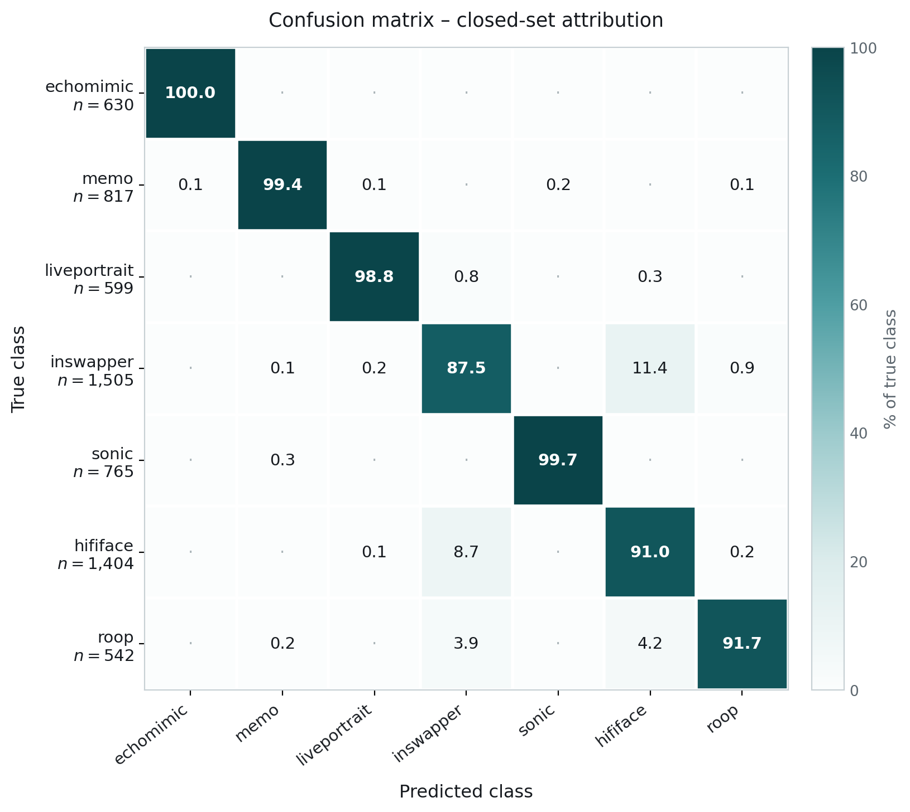
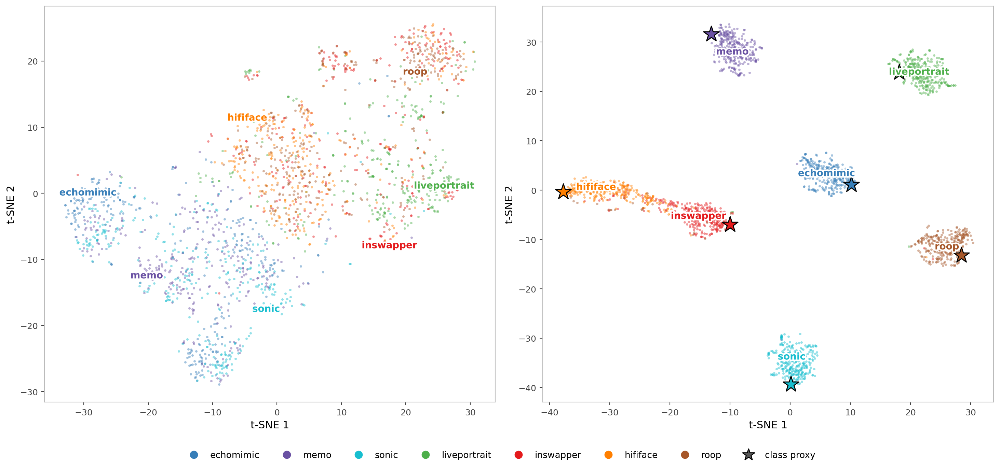

# Video deepfake attribution using Proxy-Anchor learning

Given a video clip that is already known to be a deepfake, identify **which generative method
produced it**. This ports the metric-learning methodology of
[panda](https://github.com/neamtucristian26/panda) from audio TTS source tracing to video,
on the [MAVOS-DD](https://huggingface.co/datasets/unibuc-cs/MAVOS-DD) benchmark
([arXiv:2505.11109](https://arxiv.org/abs/2505.11109)).

This repository covers the **closed-set** setting: all seven MAVOS-DD generators are
in-distribution, and the task is 7-way attribution among them.

- **talking head** — EchoMimic, Memo, Sonic
- **portrait animation** — LivePortrait
- **face swap** — InSwapper, HifiFace, Roop

## Results

Test partition, 7-way closed set:

| Metric | Value |
|---|---|
| Accuracy | **94.04 %** |
| Balanced accuracy | 95.46 % |
| Macro F1 | 95.68 % |

| Class | Precision | Recall | F1 | n |
|---|---|---|---|---|
| echomimic | 99.84 | 100.00 | 99.92 | 630 |
| memo | 99.51 | 99.39 | 99.45 | 817 |
| liveportrait | 99.16 | 98.83 | 99.00 | 599 |
| inswapper | 89.90 | 87.51 | 88.69 | 1505 |
| sonic | 99.74 | 99.74 | 99.74 | 765 |
| hififace | 86.70 | 91.03 | 88.81 | 1404 |
| roop | 96.69 | 91.70 | 94.13 | 542 |

Errors concentrate almost entirely inside the face-swap family; the other four classes are
attributed nearly without error.



t-SNE of the test clips (300 per class), before and after the learned projection. The frozen
features alone do not separate the classes -- silhouette **+0.007** -- while the projected space
reaches **+0.848**, with the class proxies sitting at the cluster centers. The Proxy-Anchor head
does nearly all of the work: a nearest-centroid classifier on the raw concatenated features
reaches 55.24 %, against 94.04 % for the full model.



## Method

**Three frozen encoders**, concatenated into a single 3840-d input vector:

| Branch | Model | Dim | Input |
|---|---|---|---|
| video | CLIP ViT-L/14 | 768 | full face, 224×224 RGB |
| video | DINOv3 ViT-L/16 | 1024 | full face, 224×224 RGB |
| video | BRAVEn Large | 1024 | grayscale mouth ROI, 96×96 → 88×88 |
| audio | BRAVEn Large | 1024 | raw waveform |

Each branch is **L2-normalised individually** before concatenation (`--l2_branches`). This is
required, not cosmetic: the raw norms differ by about two orders of magnitude, and without it a
single branch dominates the representation.

Facial landmarks come from [`face-alignment`](https://github.com/1adrianb/face-alignment) v1.5.0
(2-D FAN, Bulat & Tzimiropoulos 2017) with its default SFD detector, the implementation RAVEn's
documentation recommends. In frames with several faces, the largest face in the first frame is
selected and then tracked by nearest centroid.

**Trainable head**: 3840 → 2048 → 1024 → 512, each hidden layer followed by batch normalization,
ReLU and dropout (0.3); the 512-d output is L2-normalised. Each class owns a learned *proxy*
optimized jointly with the projection through the **Proxy-Anchor loss** (margin δ = 0.1,
α = 32). Prediction is the class whose proxy has maximum cosine similarity.

**Training**: AdamW (lr 1e-3, weight decay 1e-4, cosine schedule), 100 epochs, batch size 256,
checkpoint selected on best validation accuracy. The released checkpoint is epoch 82.

## Layout

```
src/            pipeline code
model/          released checkpoint (weights only, optimizer state stripped)
metadata_all7/  train / validation / test splits + class-index map
results/        headline metrics (tri_h2048_1024/results.json) and figures
```

## Setup

```bash
pip install -r requirements.txt
```

## Reproducing

```bash
# 1. Extract features (each writes one .pt per clip; shard across GPUs with --num_shards/--shard_id)
python src/extract_raven_embeddings.py --metadata_csv <clips.csv> \
    --output_dir data/raven_embeddings --ckpt_dir <braven_large_lrs3vox2avs>

python src/extract_dinov3_embeddings.py --metadata_csv <clips.csv> \
    --output_dir data/dinov3_embeddings --audio_dir data/raven_embeddings --all_frames

python src/extract_clip_embeddings.py --metadata_csv <clips.csv> \
    --output_dir data/clip_embeddings --audio_dir data/raven_embeddings --all_frames

# 2. Train
python src/train.py --metadata_dir metadata_all7 \
    --embeddings_dir data/clip_embeddings,data/dinov3_embeddings,data/raven_embeddings \
    --checkpoint_dir checkpoints/tri_h2048_1024 --modality fusion --l2_branches \
    --hidden_dims 2048 1024 --epochs 100 --batch_size 256

# 3. Evaluate (or point --checkpoint_dir at the released model/tri_h2048_1024)
python src/evaluate_closed_set.py --metadata_dir metadata_all7 \
    --embeddings_dir data/clip_embeddings,data/dinov3_embeddings,data/raven_embeddings \
    --checkpoint_dir model/tri_h2048_1024 --output_dir results/tri_h2048_1024 \
    --modality fusion --l2_branches

# 4. Figures
python src/plot_confusion.py --prefix results/ --config tri_h2048_1024 --no_subtitle \
    --title "Confusion matrix – closed-set attribution" \
    --output results/figures/fig_confusion.png

python src/visualize_all7.py --metadata_dir metadata_all7 \
    --embeddings_dir data/clip_embeddings,data/dinov3_embeddings,data/raven_embeddings \
    --checkpoint_dir model/tri_h2048_1024 --modality fusion --l2_branches \
    --perplexity 100 --output results/figures/fig_tsne.png
```

Both figure scripts take `--lang en|ro`.

`--embeddings_dir` takes a comma-separated list; a clip is kept only if it is present in every
directory. Branch order in the concatenated vector follows the order given.

## Inference on new clips

`src/predict.py` runs the whole pipeline on arbitrary videos so nothing needs pre-extracting. The encoders load once and are reused, so pass all your clips in one call rather than invoking it per file.

```bash
python src/predict.py clip1.mp4 clip2.mp4 \
    --braven_ckpt <braven_large_lrs3vox2avs>/ \
    --raven_repo raven_repo/ \
    --topk 3 --json predictions.json
```

```
clip1.mp4
  -> echomimic     cos=+0.3496   margin +0.7045
     hififace      cos=-0.3548
     liveportrait  cos=-0.3707
```

`cos` is the cosine similarity to each class proxy and `margin` the gap to the runner-up. Use
`--list FILE` for a path-per-line file, `--cpu` to force CPU, and `--uniform_frames` to sample
16 frames instead of reading all of them (the released model was trained on all-frame features,
so this trades accuracy for speed).

**This answers "which generator", not "is this fake".** Every class is a generator, so a real
clip is still assigned one. Attribution presupposes the clip is already known to be synthetic.

## Notes on the splits

MAVOS-DD's official protocol keeps Sonic, HifiFace and Roop out of the training set, so a 7-way
classifier cannot be trained on it directly. The splits here are our own stratified 70/15/15
partition over all seven generators (29,776 / 6,377 / 6,389 clips).

Partitioning is **at clip level**. MAVOS-DD clips are segments cut from longer source videos, so
segments of one source can land in different splits. This was kept deliberately, because the
official MAVOS-DD split has the same property and results therefore stay comparable to published
numbers on this dataset.

Of the 6,389 test clips, **6,262** are scored: a clip is evaluated only when all three encoders
produced a feature vector for it.

## Citation

```bibtex
@article{neamtu2026anchoring,
  title  = {Anchoring the Unknown: Open-Set Model Attribution via Proxy-Anchor Learning},
  author = {Neamtu, C.T. and Mihalache, S. and Smeu, S. and Oneata, D. and Cucu, H. and Burileanu, D.},
  journal = {arXiv preprint arXiv:2606.10758},
  year   = {2026}
}
```

Built on Proxy-Anchor loss (Kim et al., [arXiv:2003.13911](https://arxiv.org/abs/2003.13911)),
MAVOS-DD (Croitoru et al., [arXiv:2505.11109](https://arxiv.org/abs/2505.11109)), and
RAVEn/BRAVEn (Haliassos et al., [arXiv:2404.02098](https://arxiv.org/abs/2404.02098)).
